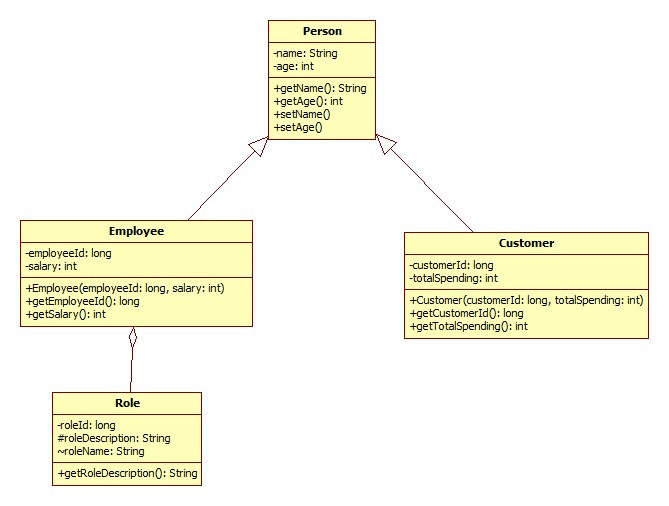

# Starting from the provided template, implement a program that follows the specifications below:

[//]: # (- Create the classes described in the diagram,elements inside and represent relationships between them. &#40;4p&#41;)

[//]: # ()
[//]: # (- Extend the program to not allow duplicate employees based on the employeeId. &#40;1p&#41;)

[//]: # ()
[//]: # (- Use the predefined Set from EmployeeManger to store and manage employees, add three employees with id and salary, and assign a name to each. &#40;1p&#41;)

[//]: # ()
[//]: # (- Display all the employees names and salary. &#40;1p&#41;)

[//]: # ()
[//]: # (- Implement a method to calculate the average salary of all employees and display the average. &#40;1p&#41;)

[//]: # ()
[//]: # (- Write unit tests to verify the correctness of the average salary calculation &#40;1p&#41;.)

- Create the classes described in the diagram,elements inside and represent relationships between them. (4p)

- Extend the program to not allow duplicate customers based on the customerId. (1p)

- Use the predefined Set from CustomerManager to store and manage customers, add three customers with id and totalSpending, and assign a name to each. (1p)

- Display all the customers names and totalSpending. (1p)

- Implement a method to find the customer with the maximum amount spent and display customerName. (1p)

- Write unit tests to verify the correctness of the search for the customer with the maximum amount spent . (1p)
